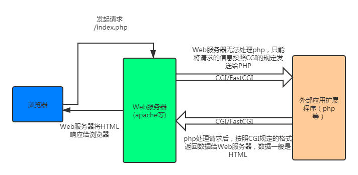

相信很多人在面试时，很多时候会被问到这样一个问题：“什么是CGI、FastCGI，以及它们之间的联系与区别”。我把网上的资料和自己的理解整理成下文。

## CGI

CGI（Common Gateway Interface）公共网关接口，**CGI是一种协议**。准确地说，CGI是应用程序（如PHP）与Web服务器交互的一个标准接口、协议。

* 根据CGI标准，编写应用程序，可以对客户端输入的数据进行处理，完成客户端与服务器的交互操作
* CGI定义了Web服务器如何向扩展应用程序发送消息，在收到应用程序信息后又何如进行处理等内容

还是通过一张图来理解上面的内容吧。

* CGI是Web 服务器与Web应用程序（php/python等）之间数据交互的一种协议
* FastCGI与CGI一样，也是Web服务器与Web应用交互的一种协议，只是FastCGI在效率上比CGI更好。

### CGI实现原理与问题

* CGI程序运行在独立的进程，而且每个Web请求都创建一个进程，在结束时销毁。这种“每个请求一个新进程”使得CGI效率较差，难以扩展。
* 在高负载情况下，用于进程创建和销毁的操作系统开销变得很大。
* 由于进程地址空间无法共享，CGI进程模型限制了重用方法，如重用数据库链接等

## FastCGI

快速通用网关接口(Fast Common GateWay Interface)与CGI一样，也是一种让应用程序与Web服务器通信的协议。FastCGI是CGI的增强版本。

* FastCGI减少了Web服务器与CGI程序之间交互的开销，使得服务器可以同时处理更多的网页请求。

### 实现

* FastCGI使用持续的进程来处理请求，这些进程由FastCGI服务器管理，而不是Web服务器。
* FastCGI像是一个常驻(long-live)型的CGI，可以一直执行着，不需要每个请求都进程创建和终止的开销

### FastCGI工作原理

1. Web服务器启动时载入FastCGI进程管理器（如PHP-FPM）
2. FastCGI进程管理器自身初始化，启动多个CGI解释器进程并等待来自Web服务器的连接
3. 当客户端请求到达Web服务器时，FastCGI进程管理器选择并连接到一个CGI解释器。Web服务器把环境变量和这个页面请求通过一个socket或TCP connection传递给FastCGI子进程
4. FastCGI子进程完成处理后将标准输出和错误信息从同一连接返回Web Server。当FastCGI子进程关闭连接时，请求便告处理完成。FastCGI子进程接着等待并处理来自FastCGI进程管理器(运行在Web Server中)的下一个连接。

### PHP-CGI

php-cgi是php自带的FastCGI管理器。

* php-cgi的不足
  * php-cgi在变更php.ini配置后需重启php-cgi才能让新的php.ini生效，没做到平滑重启
  * 直接杀死php-cgi进程，php就不能运行了

### PHP-FPM

php-fpm是PHP FastCGI管理器。FastCGI只是一个协议规范，需要每个语言具体实现，PHP-FPM就是PHP版本的FastCGI协议实现。

* 支持平滑重启，就是收到重启信号后，先kill掉空闲worker进程，新的worker用新的配置
* 可以根据请求来访压力变化动态增减worker进程数量

