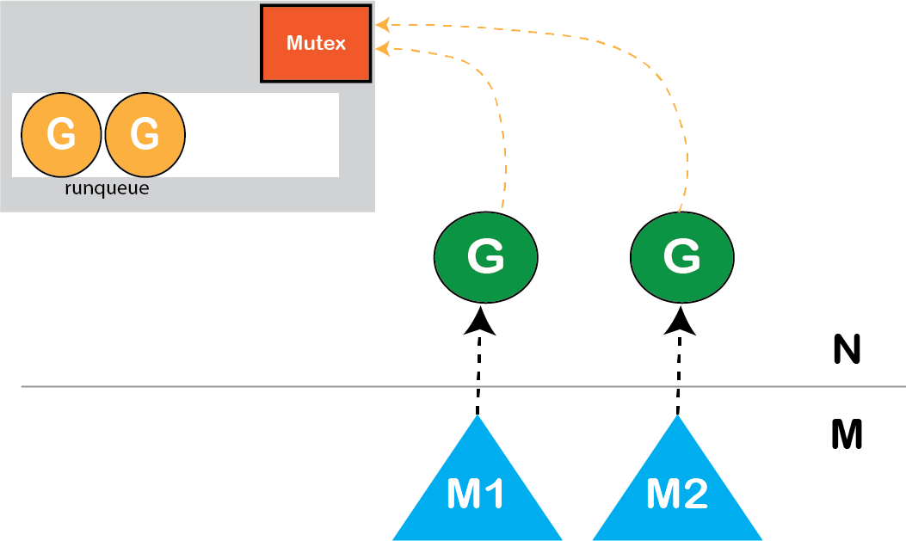
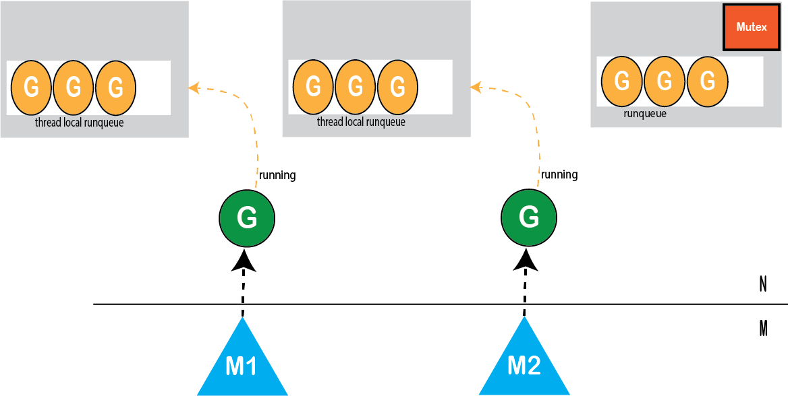
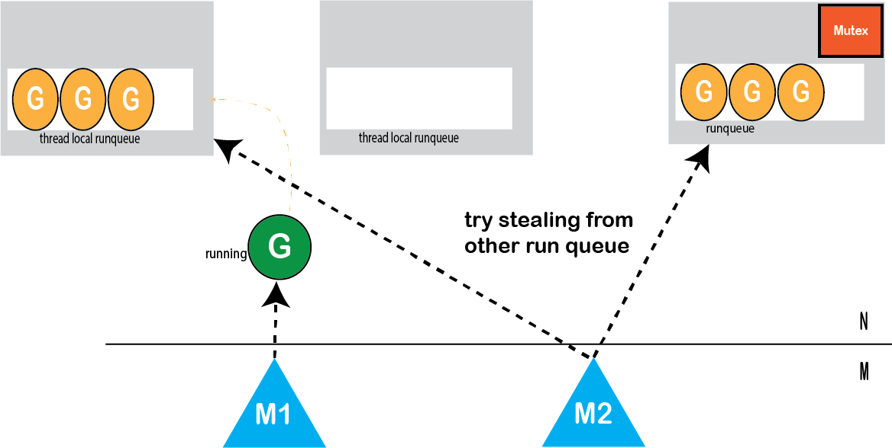
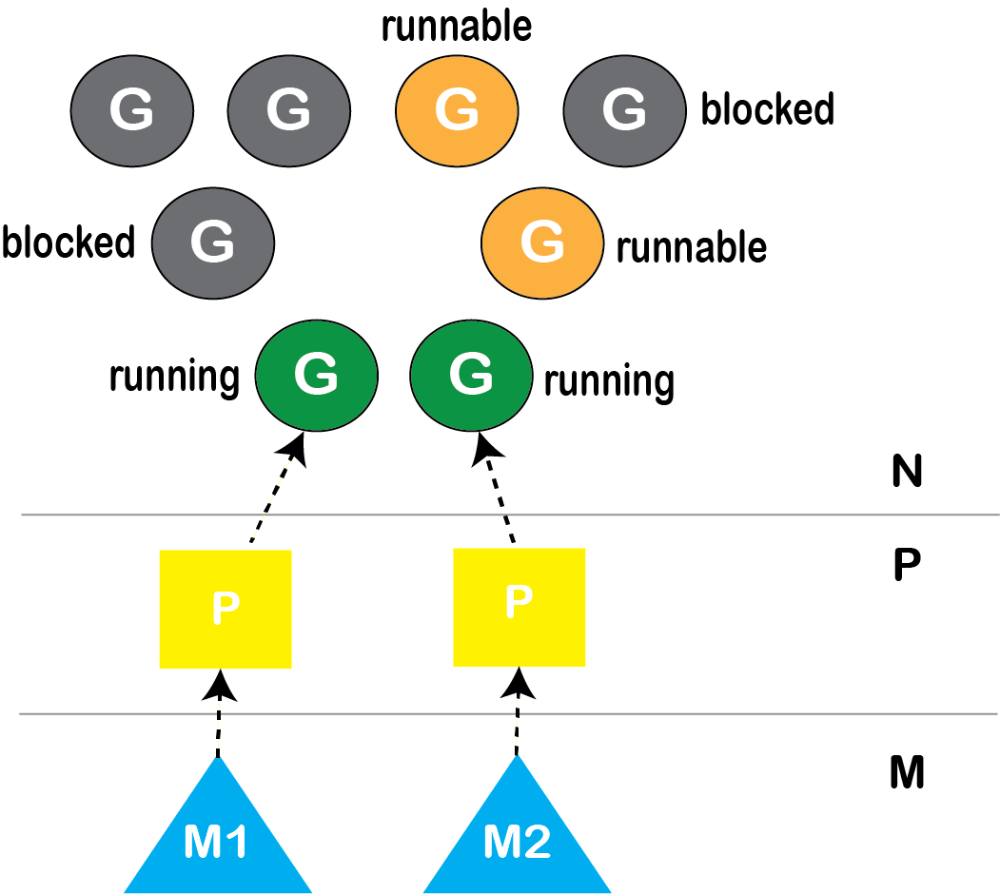
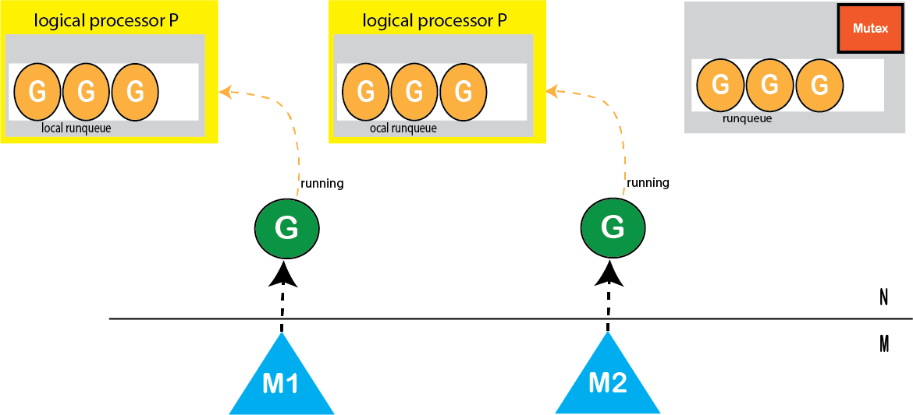

## 历史
### 进程时代
* 现代化的计算机有了操作系统，每个程序都是一个进程，但是操作系统在一段时间只能运行一个进程，直到整个进程运行完，才能运行下一个进程。这个时期可以成为
单进程时代---串行时代
后来操作系统具有了最早的并发能力：多进程开发，当一个进程阻塞的时候，切换到另外等待执行的进程，这样就能尽量把CPU利用起来，CPU就不浪费了。  
### 线程时代
* 多进程是个好东西，有了对进程的调度能力之后，但进程拥有太多资源，在创建、切换和销毁的时候，都会占用很长的时间，CPU虽然利用起来了，但CPU有很大的一部分
都被用来进程调度了。
* 后来操作系统支持了线程，线程在进程里面，线程运行所需要资源比进程少多了，跟进程比起来，切换更省空间、时间。
* 一个进程可以有多个线程，CPU在执行调度的时候切换的是程，如果下一个线程也是当前进程的，就只有线程切换，很快就能完成，如果下一个线程不是当前的进程，就
需要切换进程，这就得费时间了。
* 线程时代，CPU的调度切换的是进程和线程。多线程看起来很美好，但实际多线程编程却需要考虑很多底层细节，比如锁和冲突检测。  
### 协程
* 多进程、多线程已经提高了系统的并发能力，但是在当今互联网并发场景下，为每个任务都创建一个线程是不现实的，因为会消耗大量的内存（每个线程的内存占用级别为MB）
线程多了之后调度也会消耗大量的CPU。
* 线程分为内核态线程和用户态线程，用户态线程需要绑定内核态线程，CPU并不能感知用户态线程的存在，它只知道它在运行1个线程，这个线程实际是内核态线程。
* 用户态线程实际有个名字叫协程（co-routine），为了容易区分，我们使用协程指用户态线程，使用线程指内核态线程。
* 协程与线程是有区别的，线程由CPU调度是抢占式的，协程由用户调度是协作的，一个协程让出CPU后，才执行下一个协程。
* 协程和线程有3种映射关系：
    * N:1 N个协程绑定1个线程，优点就是协程切换非常轻量快速。
    * 1:1
    * M:N
      M个操作系统内核线程执行N个goroutine
      
#### 简单的M:N调度器
在简单的M:N调度器中，有一个全局运行队列，某些操作将一个新的goroutine放入运行队列。M个内核线程访问调度程序从“运行队列”中获取并运行goroutine。多个
线程尝试访问相同的内存区域，因此使用互斥锁来同步对该运行队列的访问。

通过Mutex同步全局运行队列，会遇到一些问题：
1. 缓存一致性保证的开销
2. 在创建，销毁和调度Goroutine G时进行激烈的锁竞争

#### 分布式调度程序：每个线程一个运行队列

直接好处是，每个线程的本地运行队列现在都没有使用mutex。依然有一个带有mutex的全局运行队列，但仅在特殊情况下使用。它不会影响可伸缩性。
Go中，轮询运行队列的顺序如下：
1. 本地运行队列
2. 全局运行队列
3. 网络轮询器
4. 工作偷窃（work stealing）
* work stealing 
    如果本地工作队列为空，请尝试从其他队列中偷窃工作
  
到目前为止，Go运行时的调度器具有以下功能：
    * 它可以处理并行执行（使用多线程）
    * 处理阻塞系统调用和网络I/O
    * 处理用户级别的阻塞调用
    * 可伸缩扩展
以上方案，存在的问题：一个系统调用中可以有多个内核线程（10或1000），这可能会比CPU核数多很多。这个方案将最终在以下期间产生了恒定的开销：
* work stealing时，它必须同时扫描所有内核线程（空闲的和运行gouroutine）本地运行队列，并且大多数都是空闲的
* 垃圾回收，内存分配器都会遇到相同的扫描问题

使用M:P:N线程克服效率问题

#### M:P:N(3级调度程序)：引入逻辑处理器P
P 表示处理器，可以将其视为在线程上运行的本地调度程序

> 逻辑进程P的数量始终是固定的。默认为当前进程可以使用的逻辑CPU数量

我们将本地运行队列放入固定数量的逻辑处理器中（而不是每个内核线程一个本地运行队列）

Go运行时首先将根据计算机的逻辑CPU数量创建固定数量的逻辑处理器P，所以现在我们以下期间没有了恒定的开销：
* work stealing ：只需扫描固定数量的逻辑处理器P的本地运行队列
* 垃圾回收，内存分配器也将获得相同的好处

## 进程和线程
* 多个线程可以属于同一个进程并共享内存空间。因为多线程不需创建新的虚拟内存空间，所以 它们也不需要内存管理单元处理上下文的切换，线程之间的通信也正是
基于共享的内存进行的，与重量级的进程相比，线程显得比较轻量。
* 虽然线程比较轻量，但是在调度时也有比较大的额外开销。每个线程都会占用1M以上的内存空间，在切换线程时不止会消耗较多的内存，恢复寄存器中的内容还需要
向操作系统申请或者销毁资源，每次线程上下文的切换都需要消耗大约1us左右的时间，但是Go调度器对Goroutine的上下文切换约为0.2us，减少了80%的额外开销。
* Go调度器通过使用与CPU数量相等的线程减少线程频繁切换的内存开销，同时在每一个线程上执行额外开销更低的Goroutine来降低操作系统和硬件的负载。
* Go在一个操作系统线程上运行多个Goroutines,Golang语言有自己的调度策略，允许多个Goroutines运行在一个同样的OS thread上。

### goroutine调度器
Go的runtime负责对goroutine进行管理。所谓的管理就是调度，粗糙地说调度就是决定何时哪个goroutine将获得资源开始、哪个goroutine应该停止执行让出资源、
哪个goroutine应该被唤醒恢复执行。
G:goroutine，每个G都代表1个goroutine
M:工作线程，是GO语言定义出来在用户层面描述系统线程的对象，每个M代表一个系统线程
P: 处理器，它包含了运行GO代码的资源