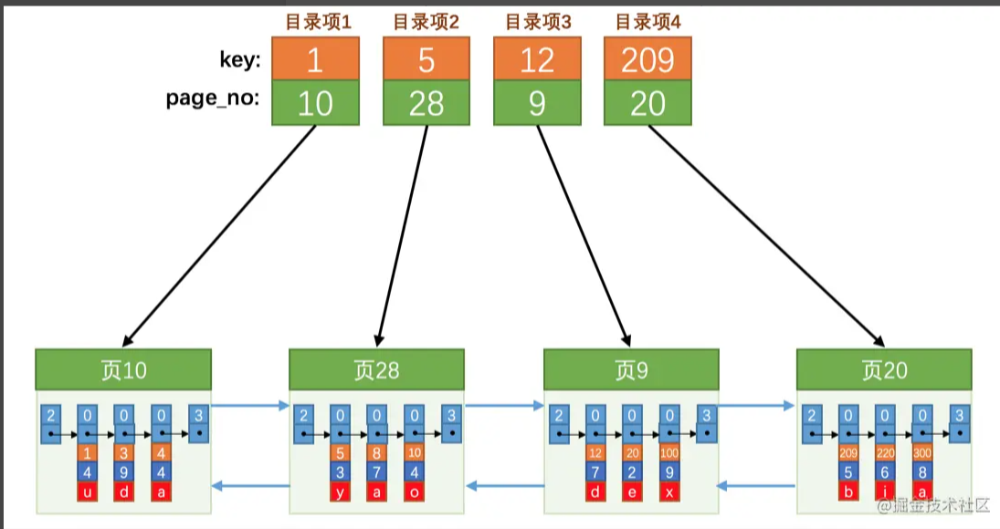

## B+树索引
> 数据页可以组成一个双向链表，而每个数据页中的记录会按照主键值从小到大的顺序组成一个单向链表，
> 每个数据页都会为存储在它里边的记录生成一个页目录，在通过主键查找某条记录的时候可以在页目录中使用二分法
> 快速定位到对应的槽，然后再遍历该槽对应分组中的记录即可快速找到指定的记录。

### 没有索引的查找
#### 在一个页的查找
目前表中的记录比较少，所有的记录都可以被存放到一个页中，在查找记录的时候可以根据搜索条件的不同分为两种情况：
* 以主键为搜索条件
在页目录中使用二分法快速定位到对应的槽，然后再遍历该槽对应分组中的记录即可
  
* 以非主键列作为搜索条件
这种情况只能从最小记录开始依次遍历单链表中的每条记录
  
#### 在很多页中查找
1. 定位到记录所在的页
2. 从所在的页内查找相应的记录
> 在没有索引的情况下，不论是根据主键列或者其他列的值进行查找，由于我们并不能快速定位到记录所在的页， 
> 所以只能从第一个页沿着双向链表一直往下找，在每一个页根据上面所说的方法来查找指定的记录。

* 页分裂
> 为了保证下一个数据页中用户记录的主键值必须大于上一个页中用户记录的主键值。MySQL会通过一些诸如记录移动的操作
>来始终保证这个状态一直成立

* 给所有页建立一个目录项
由于数据页的编号可能并不是连续的，所以在向表插入许多记录后，页在物理存储上可能并不挨着，所以如果想从
  这么多页中根据主键值快速定位某些记录所在的页，需要给它们做个目录，每个页对应一个目录项，每个目录项
  包括下边两个部分：
  * 页的用户记录中最小的主键值，我们用key来表示
  * 页号，我们用page_no表示
    

以页28为例，它对应的目录项2，这个目录项中包含着该页的页号28以及该页中用户记录的最小主键值5.
我们只需哟把几个目录项在物理存储器上连续存储，比如把他们放到一个数组里，就可以实现根据主键值快速查找
某条记录了。
比方说我们想找主键值为20的记录，具体查找过程分两步：
1. 先从目录项中根据二分法快速确定出主键值为20的记录在目录项3，它的页是页9
2. 再根据在页中查找记录的方式去页9中定位具体的记录

目录项纪录中只存储主键值和对应的页号，比用户记录需要的存储空间小多了，但是不论怎么说一个页只有16KB大小，
能存放的目录项纪录也是有限的，那如果表中的数据太多，以至于一个数据页不足以存放所有的目录项纪录。就整多一个
目录项纪录的页。