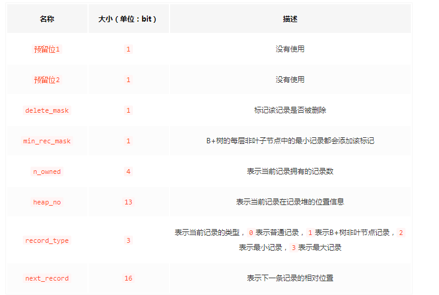

## InnoDB数据页结构
### 不同类型的页简介
* 页是InnoDB管理存储空间的基本单位，一个页的大小一般是16KB。
* InnoDB为了不同的目的设计了许多不同类型的页，比如存放表空间头部信息的页，存放Insert Buffer信息的页，存放undo日志信息的页
* 存放记录的页叫做索引(INDEX)页

### 索引页结构
页的16KB大小的存储空间可以被划分为多个部分，不同部分有不同的功能，如下：

### 记录在页中的存储
* 在页的7个组成部分中，我们存储的记录会按照我们制定的行格式存储到User Records部分。
* 一开始生成页的时候，并没有User Records，每当插入一条记录，都会从Free Space，也就是
尚未使用的存储空间中申请一个记录大小的空间划分到User Records
  
* 当Free Space部分的空间全部被User Records部分替代掉后，意味着这个页使用完了，如果
还有新的记录插入的话，就需要申请新的页

#### 记录行格式的记录头信息

记录头信息中各个属性大意如下：

* delete_mask
delete_mask属性标记当前记录是否被删除，占用1个二进制位，0未删，1被删。
> 被删除的记录之所以不立即从磁盘移除，因为移除它们之后把前台记录在磁盘上重新排列需要性能
> 消耗，所以只是打一个删除标记。所有被删除掉的记录都会组成一个所谓的`垃圾链表`，在这个链表
> 中的记录占用的空间称为`可重用空间`
> 之后如果有新记录插入到表中，可能把这些被删除的记录占用的存储空间覆盖掉。