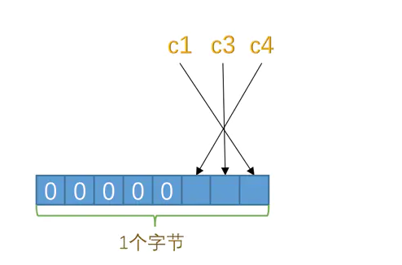

## InnoDB页简介
> 真正处理数据的过程是发生在内存中的，所以需要把磁盘中的数据加载到内存中，如果是处理写入或修改请求，
> 还需要把内存中的内容刷新到磁盘上。
* InnoDB同步磁盘数据到内存的方式
> 将数据划分为若干页，以页作为磁盘和内存之间交互的基本单位，InnoDB中页的大小一般为16KB。
> 也就是一次最少从磁盘中读取16KB的内容到内存中，一次最少把内存中的16KB内容刷新到磁盘中。

## InnoDB行格式
> 我们平时是以记录为单位来向表中插入数据的，这些记录在磁盘上的存放方式也被称为行格式或者记录格式。

* InnoDB存储引擎的4种不同类型的行格式
 1. Compact 2. Redundant 3. Dynamic 4. Compressed

* 指定行格式的语法
> create table table_na (...) row_format=行格式名称

### Compact行格式

一条完整的记录可以被分为记录的额外信息和记录的真实数据两大部分

#### 记录的额外信息
记录的额外信息是服务器为了描述这条记录不得不额外添加的一些信息，这些额外分为3类，分别是变长字段长度列表、
  NULL值列表和记录头信息
  
* 变长字段长度列表
变长字段中存储多少字节的数据是不固定的，所以我们在存储真实数据的时候需要把这些数据占用的字节数也存起来。
  > 所以这些变长字段占用的存储空间分为两部分：
  1. 真正的数据内容
    2. 占用的字节数
    
在Compact行格式中，把所有变长字段的真实数占用的字节长度都存放在记录的开头部位，从而形成一个变长字段长度列表，各变长字段数据占用的字节数按照列的顺序
逆序存放。

> 变长字段长度列表占用的字节数是1或2个字节
> 确定使用1个字节还是2个字节的规则： 
> 1. 如果VARCHAR(M)，M <= 255，使用1个字节来表示真正字符串占用的字节数
> 2. 如果M > 255，则分为两种情况：
>   1. 如果实际存储的字符串占用的字节数 <= 127，则用1个字节数表示真正字符串占用的字节数
>   2. 如果 > 127，则用2个字节来表示真正字符串占用的字节数
> 变长字段长度列表中只存储值为非NULL的列内容占用的长度，值为NULL的列的长度是不存储的。

* NULL值列表
Compact列格式把NULL的列统一管理起来，存储到NULL值列表中。处理过程：
  1. 首先统计表中允许存储NULL的列有哪些
  > 主键列、被NOT NULL修饰的列都是不可以存储NULL值的，所以在统计的时候不会把这些列算进去。
  2. 如果表中没有允许存储NULL的列，则NULL值列表也不存在了，否则将每个允许存储NULL的列对应一个二进制位，
  二进制位按照列的顺序逆序排序。
  > 二进制位的值为1，表示该列值为NULL；值为0，代表该列值不为NULL
  3. MySQL规定NULL值列表必须用整数个字节的位表示，如果使用的二进制位个数不是整数个字节，则在字节的高位补0
  > 如某表只有3个值允许为NULL的列，对应3个二进制位，不足一个字节，所以在字节的高位补0，效果如下图：
  > 如果一个表中有9个允许为NULL，那这个记录的NULL值记录部分就需要2个字节来表示了。
 
  
* 记录头信息
除了变成字段长度列表、NULL值列表，还有一个用于描述记录的记录头信息。它是由固定的5个字节组成。5个字节也就是
  40个二进制位，不同的位代表不同的意思。如图：
  
  
二进制位代表的详细信息如下：

#### 记录的真实数据
记录的真实数据除了定义的列数据以外，MySQL会为每个记录默认的添加一些列（称为隐藏列），具体的列如下：

InnoDB对主键的生成策略：优先使用用户自定义主键作为主键，如果用户没有定义主键，则选取一个Unique键作为主键，
如果Unique键都没有定义，则InnoDB会为表默认添加一个名为row_id的隐藏列作为主键。

#### CHAR(M)列的存储格式
在Compact行格式下只会把变长类型的列的长度逆序存到变长字段长度列表中，但这只是因为表采用的是ascii字符集，
ascii字符集是一个定长字符集。如果采用变长的字符集的话，CHAR(M)列的长度也会被存储到变长字段长度列表中。
> 对于CHAR(M)类型的列来说，当列采用的是定长字符集时，该列占用的字节数不会被加到变长字段长度列表，
> 而如果采用变长字符集时，该列占用的字节数也会被加到变长字段长度列表。

> 变长字符集的CHAR(M)类型的列要求至少占用M个字节，而VARCHAR(M)却没有这个要求。
### 行溢出数据
#### 记录中数据太多产生的溢出
> 我们的记录都会被分配到某个页中存储。而一个页的大小一般是16KB，也就是16384字节，而一个varchar(m)类型的
列最多可以存储65532个字节，这样就可能造成一个页存放不了一条记录的情况。

> 在Compact和Redundant行格式中，对于占用存储空间非常大的列，在`记录的真实数据`处只会存储该列的一部分数据，
> 把剩余的数据分散存储到几个其他的页中，然后`记录的真实数据`处用20个字节存储指向这些页的地址。

> 从上图可以看出，对于Compact和Redundant行格式来说，如果一列中的数据非常多，在本记录的真实数据处只会存储
> 该列的前768个字节的数据和指向其他页的地址，然后把剩下的数据存放到其他页中，这个过程叫做`行溢出`

> 不只是 VARCHAR(M) 类型的列，其他的 TEXT、BLOB 类型的列在存储数据非常多的时候也会发生行溢出

### Dynamic和Compressed行格式
> MySQL5.7版本默认行格式是Dynamic。Dynamic、Compressed和Compact行格式很相似，不过在处理行溢出数据有不同
> Dynamic和Compressed不会在记录的真实数据处存储字段真实数据的前768个字节，而是把所有的字节都存储到其他
> 页面中，只在记录的真实数据处存储其他页面的地址。

> Compressed行格式和Dynamic不同的一点是，Compressed行格式会采用压缩算法对页面进行压缩，以节省空间
