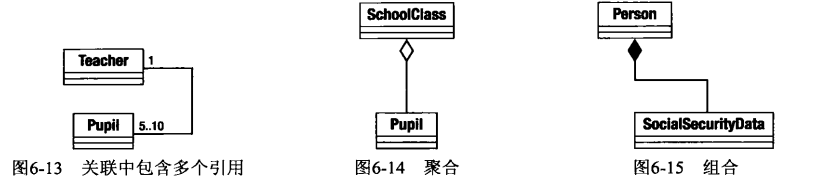

## UML

随着代码示例的增长以及复杂性的增加，仅适用代码来说明设计变得有些荒诞，很难从几行代码上看出整体情况。

UML是Unified Modeling Language(统一建模语言)的缩写。

类图可以清晰地描述结构和模式。通过类图我们可以清楚地看出结构和模式的意图，而如果只阅读代码片段和项目符号列表，则很难做到这一点。

### 类图
类图(class diagram)只是UML的一部分，但他们可能是最常用的。

1. 描述类

类是类图的主要部分。如图6-1所示，类用带有类名的方框来描述。

这个类被分为3部分，最先显示的是类的名称。下面两部分是可选的，用于显示类名之外的信息。在设计类图时，我们会发现图6-1这样的详细程度已经足够描述一些类。我们并非总要在类图中显示类的每个属性和方法，甚至不需要要显示每个类。

通常用斜体类名(如图6-2所示)，或者增加{abstact}到类名下(如图6-3所示)来表示该类是抽象类。第一种方法比第二种方法常用。

接口的定义方式和类相同，但接口必须使用一个衍型(UML的一个扩展)，如图6-4所示。

### 属性
一般来说，属性(attribute)用于描述一个类的属性(property)。属性直接列在类名下面的格子中，如图6-5所示。

下面举例看一下属性。属性前面的符号表示该属性可见性(visibility)的级别或者是访问控制。表6-1展示了可用的3种符号。

可见性符号之后是属性名。这里我们描述了ShopProduct::$price属性。冒号用于分隔属性名和它的类型以及默认值

### 操作

操作(operation)用于描述类方法，更准确地说，用于描述可以在类的实例上调用的操作。图6-6显示了ShopProduct类中的两个操作。

如上所示，操作和属性使用了相似的语法，可见性符号放在方法名之前。参数列表包含在括号之中。方法如果有返回类型的话，用冒号来描述。参数用逗号来分隔，并且遵守属性语法，参数名和它的数据类型间用冒号分隔。

但是，这个语法比较灵活。可以省略可见性标记和返回类型。我们通常只提供参数的类型，而参数名则不怎么重要。

### 描述继承和实现

UML一般用一般化来描述继承关系。这个关系用从子类到父类的一条线来标识，线的顶端有一个空心闭合箭头。

图6-7显示了ShopProduct类和它的子类之间的关系。

UML用实现来描述接口和实现接口的类之间的关系。因此如果ShopProduct类实现了Charge接口，就可以把他加入类图中，如图6-8所示。

### 关联

继承只是面向对象系统中诸多关系中的一种。当一个类的属性保存了对另一个类的一个实例(或多个实例)的引用时，就产生了关联。

在图6-9中，我们为两个类建立模型，并创建类之间的关联。

现在类之间的关系依然有些模糊。我们只是指出Tearcher对象拥有一个或多个对Pupil对象的引用，或者Pupil对象拥有一个或多个对Tearcher对象的引用。

事实上，我们可以用箭头来描述关联的方向。如果Teacher类拥有Pupil类的一个实例，但Pupil类没有Teacher类的实例，那么我们可以让关联箭头从Teacher指向Pupil类。这种关联称为单向关联，如图6-10所示：

如果两个类互相拥有对方的引用，可以用一个双向箭头来描述这种“双向关联”关系，如图6-11所示。

我们也可以在关联中指定一个类的实例被其他类引用的次数，这可以通过把次数或范围放在每个类旁边来说明。用星号(*)表示任意次数。在图6-12中，有一个Teacher对象和零个到多个Pupil对象。

### 聚合和组合

与关联很相似，聚合和组合都描述了一个类长期持有其他类的一个或多个实例的情况。通过聚合和组合，被引用的对象实例称为引用对象的一部分。

在聚合的情况下，被包含对象是容器的一个核心部分，但是他们也可以同时被其他对象所包含。

聚合关系用一条以空心菱形开头的线来说明。

在图6-14中，我们定义了两个类，SchoolClass和Pupil。SchoolClass类聚合了Pupil。

学生组成一个班级，但是相同的Pupil对象可以同时被不同的SchoolClass实例引用。如果我们要删除一个学校类，不需要同时删除它引用的这些学生类，因为学生类还可以引入到其他班级。

组合则是一个更强的关系。在组合中，被包含对象只能被它的容器所引用。当容器被删除时，它也应该被删除。

组合关系可以用类似聚合关系的方式描述，但是菱形必须是实心的。图6-15说明了一个组合关系。

### 描述使用
一个对象使用另一个对象的关系在UML中被描述为一个依赖关系。这是一种短暂的关系，因为它并非描述类之间的长久关系。

一个被使用的类可以作为类方法的参数传递或者作为方法调用的结果得到。

图6-16中的Report类使用了ShopProductWrite对象。这种使用关系由一条连接两个类的虚线和开放箭头表示。然而，Report类并没有把ShopProductWriter保存为类中的属性，而ShopProductWriter对象则将一组ShopProduct对象作为属性。

### 使用注解

类图可以捕捉到系统的结构，但类图并不能解析类处理任务的过程。如图6-17中，我们使用了注解来补充说明。

如图6-17所示，注解由一个折角的方框组成。它通常包含伪代码片段。

注解使类图变得易于理解。现在我们可以看到Report对象使用了ShopProductWriter来输出产品数据。

