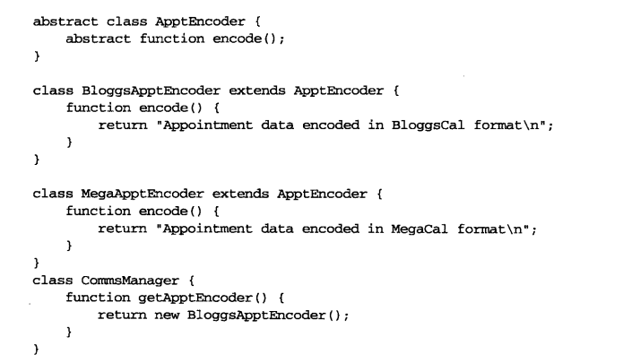
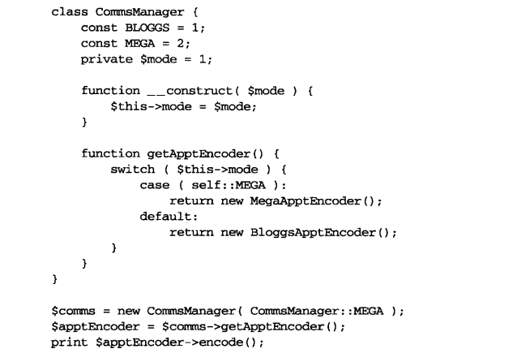
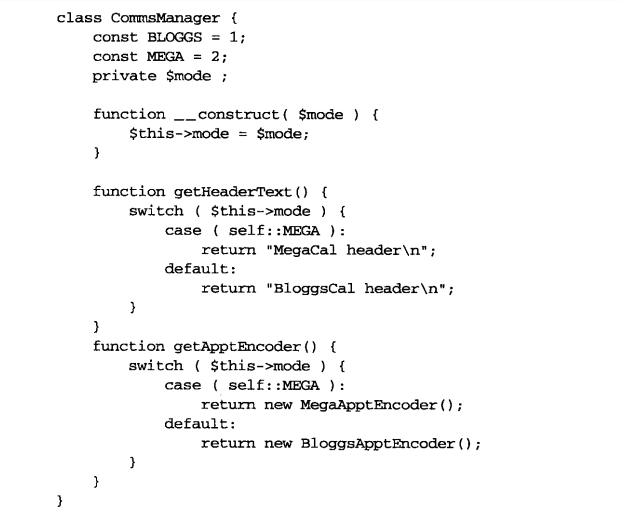

## 生成对象

创建对象是一件棘手的事情。利用多态带来的灵活性(在运行时切换不同的具体实现)，我们可以采用多种面向对象设计方案来处理优美且简洁的抽象类。

本章包括以下内容：

1. 单例模式：生成一个且只生成一个对象实例的特殊类
2. 工厂方法模式：构建创建者类的继承层级。
3. 抽象工厂模式：功能相关产品的创建。
4. 原型模式：使用克隆来生成对象。

### 生成对象的问题和解决方法

对象创建有时会成为面向对象设计的一个薄弱环节。鼓励在类中使用抽象的类，这使代码更具有灵活性，可以让你在运行时使用从不同的具体子类中实例化的对象。但缺点是对象实例化被推迟。

### 单例模式

全局变量是面向对象程序员遇到的引发bug的主要原因之一。这是因为全局变量将类捆绑于特定的环境，破坏了封装。

如果新的应用程序无法保证一开始就定义相同的全局变量，那么一个依赖于全局变量的类就无法从一个应用程序中提取出来并应用到新的应用程序中。

### 问题

经过良好设计的系统一般通过反复调用来传递对象实例。每个类都会与背景环境保持独立，并通过清晰的通信方式来与系统中其他部分进行写作。

假设有一个用于保存应用程序信息的Preferences类。我们可能会使用一个Preferences对象来保存诸如DSN(用于保存数据库的表以及用户信息)字符串，URL根目录、文件路径等数据。这些信息在你每次部署程序时都可能不同。

但在对象中传递Preferences对象并不总是个好注意。你可以让原来并不使用Preferences对象的类强制性地接受Preferences对象，以便这些类能传递Preferences对象给其他对象。但这样做产生了另一种形式的耦合。

我们还需要保证系统中的所有对象都使用同一个Preferences对象。我们不希望一些对象在一个Preferences对象上设值。

## 单例模式好处

1. 始终只有一个对象，避免了不一致状态。
2. 适度使用单例模式可以改进系统的设计，避免在系统中传递那些不必要的对象。

### 工厂方法模式

面向对象设计强调“抽象类高于实现”。也就是说，我们要尽量一般化而不是特殊化。工厂方法模式解决了当代码关注于抽象类型时如何促进对象实例的问题。答案便是用特定的类来处理实例化。

* 问题

假设有一个关于个人事务管理的项目，其功能之一是管理Appointment(预约)对象。我们的业务团队和另一个公司建立了关系，目前需要用一个叫做BloggsCal的格式来和她们交流预约相关的数据。但是业务团队提醒我们将来可能要面对更多的数据格式。

在接口级别上，我们可以立即定义两个类。其一是需要一个数据编码器来把Appointment对象转换成一个专有的格式，将这个编码器命名为ApptEncoder类；

另外需要一个管理员类来获得编码器，并使用编码器与第三方进行通信，我们将这个管理类命名为CommsManager类。使用模式术语来描述，COmmsManager便是创建者，而ApptEncoder是产品。

但是如何得到一个具体的ApptEncoder对象？

我们可以要求传递ApptEncoder给CommsManager，但这只是延缓了问题，而我们希望问题在此彻底解决。

因此，先在CommsManager类中直接实例化BloggsApptEncoder对象。

CommsManager类负责生成BloggsApptEncoder对象。当团队合作关系发生改变，而我们被要求转换系统来使用一个新的格式MegaCal时，可以只添加一个条件语句到CommsManager::getApptEncoder()方法。下面来建立一个新的可以同时处理BloggsCal和MegaCal格式的CommsManager的实现。

在类中我们使用常量标志定义了脚本可能运行的两个模式：MEGA和BLOGGS，在getApptEnconder()方法中使用swtich语句来检查$mode属性，并实例化适当的ApptEncoder。

这种方式还有一点小小的缺陷。通常情况下，创建对象的确需要指定条件，但有时候条件语句会被当做坏的“代码味道”的象征。如果重复的条件语句蔓延在代码中，我们不应该感到乐观。

CommsManager类已经能够提供交流日历数据的功能，但是，假设我们所使用的协议要求提供页眉和页脚数据来描述每次预约，情况又将如何呢？下面扩展之前的例子来支持getHeaderText()方法。

