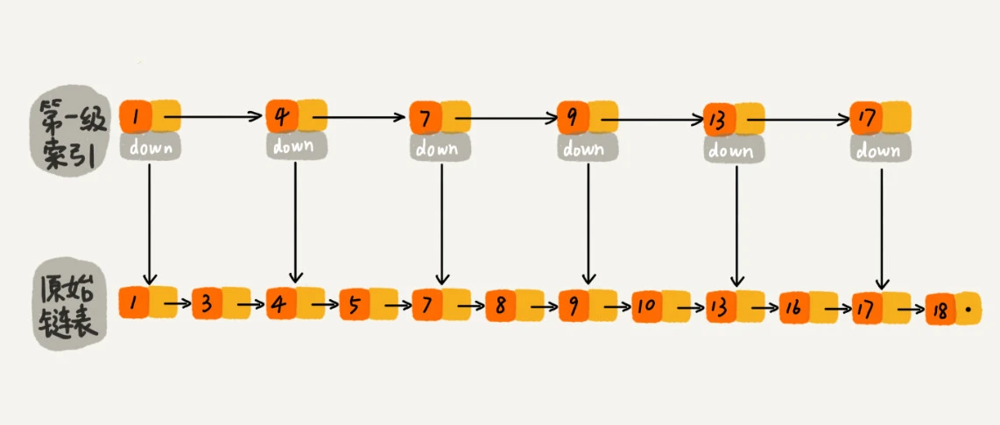

## 跳表
Redis中的有序集合就是用跳表来实现的。
给链表建立一级索引，每两个结点提取一个结点到上一级，把抽出来的那一级叫做索引或索引层。

如果现在要查找某个结点，如16，可以先在索引层遍历，当遍历到索引层中值为13的结点时，发现下一个结点是17，那要查找的结点16就在这两个结点
之间。然后通过索引层结点的down指针，下降到原始链表这一次，继续遍历。

### 跳表的时间复杂度
一个单链表中查询某个数据的时间复杂度是O(n)。那么在一个具有多级索引跳表中，查询某个数据的时间复杂度是O(logn)
跳表的时间复杂度与二分查找是一样的，换句话说，其实是基于单链表实现了二分查找，不过前提是建立了很多级索引，以空间换时间。

### 跳表的动态插入和删除
跳表这个动态数据结构，不仅支持查找操作，还支持动态的插入、删除操作，而且插入、删除操作的时间复杂度也是O(logn)

### 跳表索引动态更新
当不停地往跳表中插入数据时，如果不更新索引，就有可能出现2个索引结点之间数据非常多的情况。极端情况下，跳表还会退化成单链表。
作为一种动态数据结构，我们需要某种手段来维护索引与原始链表大小之间的平衡，也就是说，如果链表中结点多了，索引结点就相应地增加一些，
避免复杂度退化，以及查找、插入、性能操作性能下降。

* 跳表是通过随机函数来维护索引与原始链表大小之间的平衡

#### 为什么Redis要用跳表来实现有序集合，而不是红黑树
Redis中的有序集合是通过跳表+散列表来实现的，Redis的有序集合支持的核心操作主要有：
1. 插入一个数据
2. 删除一个数据
3. 查找一个数据
4. 按照区间查找数据
5. 迭代输出有序序列
其中，插入、删除、查找以及迭代输出这个几个操作，红黑树也可以完成，时间复杂度与跳表是一样的。但是按照区间来查找数据这个操作，红黑树的
效率没有跳表高。对于按照区间查找数据这个操作，跳表可以做到O(logn)的时间复杂度定位区间的起点，然后在原始链表中顺序往后遍历就可以了。

原因：1. 区间查找数据，跳表效率更好 2. 跳表代码更容易实现，比红黑树好懂、可读性好 3. 跳表更加灵活，可以通过改变索引构建策略，有效平衡
执行效率和内存消耗。
* 跳表也不能完全替代红黑树。因为红黑树比跳表的出现要早一些，很多编程语言中的Map类型都是通过红黑树实现的。但是跳表没有一个现成的实现，
所以在开发中，如果想使用跳表，必须要自己实现。
